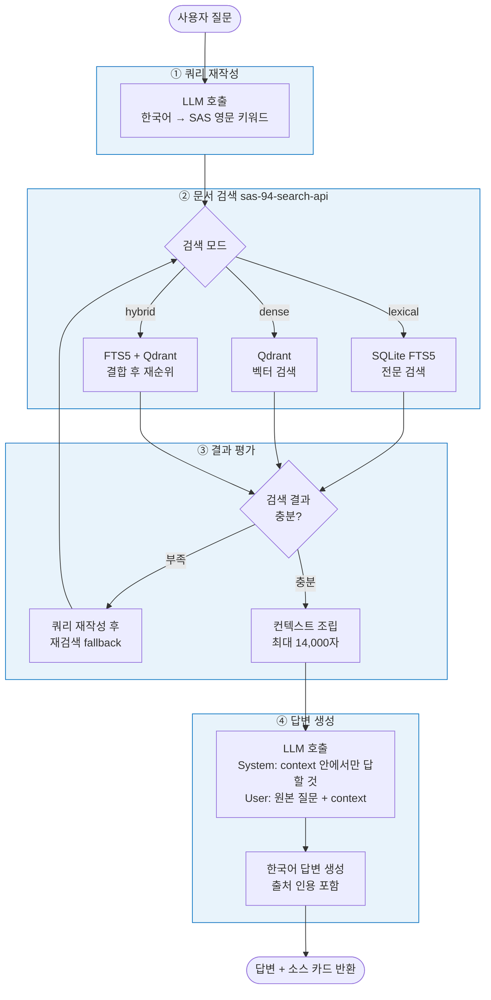

# RAG 프로세스 흐름도

```mermaid
flowchart TD
    A([사용자 질문]) --> B

    subgraph REWRITE["① 쿼리 재작성"]
        B[LLM 호출\n한국어 → SAS 영문 키워드]
    end

    REWRITE --> C

    subgraph SEARCH["② 문서 검색  sas-94-search-api"]
        C{검색 모드}
        C -->|lexical| D[SQLite FTS5\n전문 검색]
        C -->|dense| E[Qdrant\n벡터 검색]
        C -->|hybrid| F[FTS5 + Qdrant\n결합 후 재순위]
    end

    D & E & F --> G

    subgraph EVAL["③ 결과 평가"]
        G{검색 결과\n충분?}
        G -->|부족| H[쿼리 재작성 후\n재검색 fallback]
        H --> C
        G -->|충분| I[컨텍스트 조립\n최대 14,000자]
    end

    I --> J

    subgraph GEN["④ 답변 생성"]
        J[LLM 호출\nSystem: context 안에서만 답할 것\nUser: 원본 질문 + context]
        J --> K[한국어 답변 생성\n출처 인용 포함]
    end

    K --> L([답변 + 소스 카드 반환])

    style REWRITE fill:#e8f3fb,stroke:#0070C0
    style SEARCH  fill:#e8f3fb,stroke:#0070C0
    style EVAL    fill:#e8f3fb,stroke:#0070C0
    style GEN     fill:#e8f3fb,stroke:#0070C0
```
